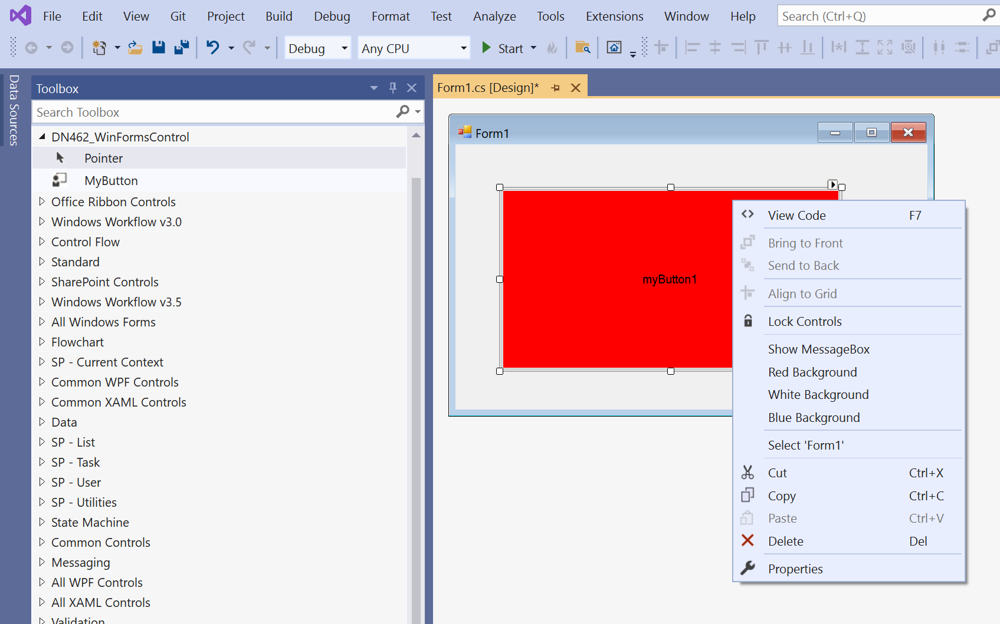
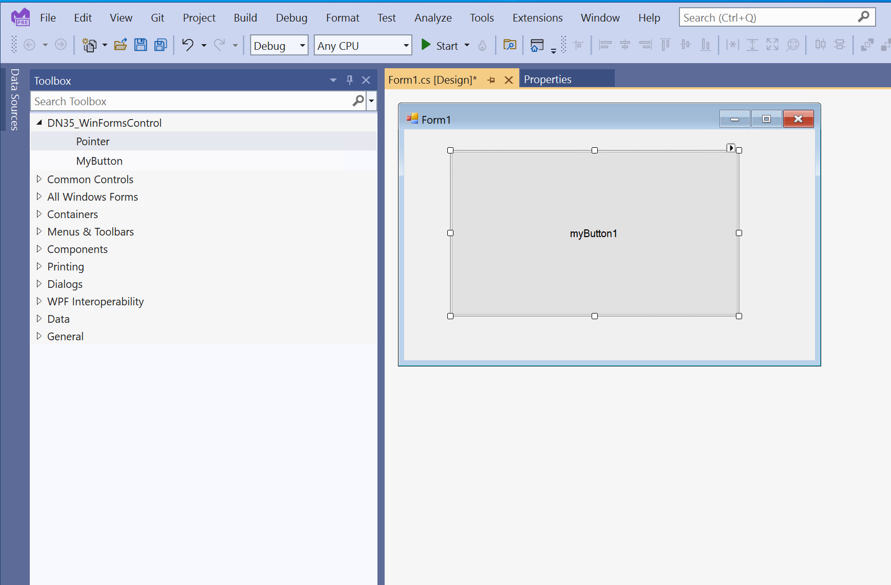

# VS2022-NetFramework4.6.2-WinFormsControl-RegistryEntries

## VS2022 Preview 4 testing
Some progress: VS2022 Preview 4 now loads controls into the VS toolbox from Toolbox Controls Installer registry entries in the 32-bit (WOW6432NODE) registry hive.

What's not working: The registry entry to inform VS2022 about designer extensibility in an external .design.dll doesn't work for my control from the 32-bit registry hive (this was working when VS2022 was able to read from the 64-bit registry hive)

**To observe the VS2022 designer extensibility bug follow the steps below in VS2019 (SUCCESS: behaves correctly) and VS2022 (FAIL)**
1. Open the DN462_WinFormsControl.sln in Visual Studio 2019 or VS2022 Preview.
2. Build release configuration
3. From the solution folder run DN462_CopyBinToTempFolder.bat (or copy files by hand) to copy bin output to the paths below:
    - C:\temp\DN462_WinFormsControl\bin\DN462_WinFormsControl.dll
    - C:\temp\DN462_WinFormsControl\bin\design\DN462_WinFormsControl.Design.dll
4. Run DN462_32bitHiveRegistryEntries.reg to add 32-bit **WOW6432Node** registry entries that:
      - Automatically loads MyButton control into the VS2019 and VS2022 Toolbox for Windows Forms projects
      - Inform VS2019 (this is a SUCCESS) and VS2022 (this FAILS currently) that DN462_WinFormsControl.Design.dll is in the Design subfolder (supports designer extensibility)
6. **The VS2019 Test: SUCCESS**
    - In VS2019 make a new .Net Framework 4.6.2 Windows Forms project:
      1. Open the Form1 design surface.
      2. Open the VS2019 Toolbox. Observe that the MyButton control is in the VS toolbox (thanks to the toolbox registry entry in step 4)
      3. Click MyButton in the toolbox and then click+drag on Form1 design surface to draw MyButton control
      4. **SUCCESS**: Rt-click MyButton control on Form1 design surface to use functional design-time context menu items
5. **The VS2022 Preview 4 Test: FAIL (MyButton control designer extensibility not working)**
    - In VS2022 make a new .Net Framework 4.6.2 Windows Forms project:
      1. Open the Form1 design surface.
      2. Open the VS2022 Toolbox. Observe that the MyButton control is **NOT** in the VS toolbox.
      3. Click MyButton in the toolbox and then click+drag on Form1 design surface to draw MyButton control
      4. **FAIL**: control shows in the Form1 tray area. This appears to be a designer extensibility issue.

## VS2022 Preview 3.1 testing
A possible bug in VS2022 Preview 3.1 is it doesn't apply the "Toolbox Controls Installer" registry entry to automatically populate the VS2022 toolbox with a .NET Framework 4.6.2 Windows Forms custom control. This works in VS2019.

Microsoft documentation (see the sections about AssemblyFoldersEx registration):  [The Toolbox Controls Installer](https://www.microsoft.com/en-us/download/details.aspx?id=35536)

In this repo I use the following acronymns:
- DN462 for .Net Framework 4.6.2
- DN35 for .Net Framework 3.5

There are two folders in this repo.
1. NetFramework4.6.2_Example - A .Net Framework 4.6.2 Windows Forms custom control example that shows Microsoft's "Toolbox Controls Installer" registry entry working in VS2019, but not working in VS2022
2. NetFramework3.5_Example - A .Net Framework 3.5 Windows Forms custom control example that shows Microsoft's "Toolbox Controls Installer" registry entry working in **both** VS2019 and VS2022!
  
### Folder NetFramework4.6.2_Example contains a .Net Framework 4.6.2 example of a Windows Forms custom control. Registry entries should populate the VS toolbox (using Visual Toolbox Installer) and inform Visual Studio the location of an external .design.dll file used for designer extensibility.

Follow the steps below to see the NetFramework4.6.2_Example in VS2019 and VS2022
1. Open the DN462_WinFormsControl.sln in Visual Studio 2019 or VS2022 Preview.
2. Build release configuration
3. From the solution folder run DN462_CopyBinToTempFolder.bat (or copy files by hand) to copy bin output to the paths below:
    - C:\temp\DN462_WinFormsControl\bin\DN462_WinFormsControl.dll
    - C:\temp\DN462_WinFormsControl\bin\design\DN462_WinFormsControl.Design.dll
4. **The VS2019 Test: SUCCESS**
    - Run DN462_RegistryEntriesForVS2019.reg to add 32-bit **WOW6432Node** registry entries that:
      - Automatically loads MyButton control into the VS2019 Toolbox for Windows Forms projects
      - Inform VS2019 that DN462_WinFormsControl.Design.dll is in the Design subfolder (supports designer extensibility)
    - In VS2019 make a new .Net Framework 4.6.2 Windows Forms project:
      1. Open the Form1 design surface.
      2. **SUCCESS**: Open the VS2019 Toolbox. Observe that the MyButton control is in the VS toolbox (thanks to the toolbox registry entry in step 4)
      
      3. Click MyButton in the toolbox and then click+drag on Form1 design surface to draw MyButton control
      4. Rt-click MyButton control on Form1 design surface to use functional design-time context menu items
5. **The VS2022 Preview Test: FAIL (toolbox not automatically populated with MyButton control)**
    - Run DN462_RegistryEntriesForVS2022.reg to add 64-bit registry entries that:
      - Automatically loads MyButton control into the VS2022 Toolbox for Windows Forms projects
      - Inform VS2022 that DN462_WinFormsControl.Design.dll is in the Design subfolder (supports designer extensibility)
    - In VS2022 make a new .Net Framework 4.6.2 Windows Forms project:
      1. Open the Form1 design surface.
      2. FAIL: Open the VS2022 Toolbox. Observe that the MyButton control is **NOT** in the VS toolbox.
      3. WORKAROUND: In the VS2022 toolbox Rt-click and "choose items..." to select C:\temp\DN462_WinFormsControl\bin\DN462_WinFormsControl.dll
      4. Click MyButton in the toolbox and then click+drag on Form1 design surface to draw MyButton control
      5. Rt-click MyButton control on Form1 design surface to use functional design-time context menu items

### Folder NetFramework3.5_Example contains a .Net Framework 3.5 example of a Windows Forms custom control. Registry entries should populate the VS toolbox (using Visual Toolbox Installer) and inform Visual Studio the location of an external .design.dll file used for designer extensibility.
Follow the steps below to see the NetFramework3.5_Example in VS2019 and VS2022. You may have to install .Net Framework 3.5.
1. Open the DN35_WinFormsControl.sln in Visual Studio 2019 or VS2022 Preview.
2. Build release configuration
3. From the solution folder run DN35_CopyBinToTempFolder.bat (or copy files by hand) to copy bin output to the paths below:
    - C:\temp\DN35_WinFormsControl\bin\DN35_WinFormsControl.dll
    - C:\temp\DN35_WinFormsControl\bin\design\DN35_WinFormsControl.Design.dll
4. **The VS2019 Test: SUCCESS**
    - Run DN35_RegistryEntriesForVS2019.reg to add 32-bit **WOW6432Node** registry entries that:
      - Automatically loads MyButton control into the VS2019 Toolbox for Windows Forms projects
      - Inform VS2019 that DN35_WinFormsControl.Design.dll is in the Design subfolder (supports designer extensibility)
    - In VS2019 make a new .Net Framework 3.5 Windows Forms project:
      1. Open the Form1 design surface.
      2. **SUCCESS**: Open the VS2019 Toolbox. Observe that the MyButton control is in the VS toolbox (thanks to the toolbox registry entry in step 4)
5. **The VS2022 Preview Test: SUCCESS**
    - Run DN35_RegistryEntriesForVS2022.reg to add 64-bit registry entries that:
      - Automatically loads MyButton control into the VS2022 Toolbox for Windows Forms projects
      - Inform VS2022 that DN35_WinFormsControl.Design.dll is in the Design subfolder (supports designer extensibility)
    - In VS2022 make a new .Net Framework 3.5 Windows Forms project:
      1. Open the Form1 design surface.
      2. **SUCCESS**: Open the VS2022 Toolbox. Observe that the MyButton control **IS** in the VS 2022 toolbox.
      
      
      

